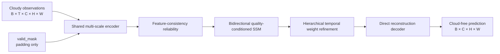

# TMFNet++

**Variable-length, quality-aware temporal fusion for optical remote-sensing cloud removal.**

TMFNet++ is a research extension of the public
[TMFNet](https://github.com/Zhangyu-student/TMFNet) implementation. It retains
the original Sen2_MTC data layout while replacing the fixed three-frame fusion
path with a variable-length, internally consistent architecture.

> This repository is an independent extension, not the official implementation
> of the TMFNet paper. No benchmark numbers are claimed until the corresponding
> experiments and ablations have been completed.

## Design at a glance



The input contains only multi-band cloudy observations. Acquisition dates,
time intervals, and externally supplied cloud masks are not required. The
decoder predicts the clear image directly rather than predicting a residual
that is added back to an input frame.

## Main changes from TMFNet

1. **Variable-length temporal inputs**
   - Training can randomly sample `T=2...6` observations.
   - Batches are padded with an explicit `valid_mask`.
   - Inference supports any temporal length that fits memory.

2. **Quality-conditioned bidirectional selective SSM**
   - Pure PyTorch input-dependent diagonal state-space scan.
   - Forward and backward temporal states are merged.
   - Reliability controls the selective state updates.

3. **Feature-consistency quality estimation**
   - Reliability means `1 = reliable`, `0 = degraded` throughout the code.
   - It uses each feature and its difference from a temporal reference.
   - Each time step receives an independent sigmoid quality score; quality
     scores are not forced to sum to one and are learned end-to-end without
     dates, cloud masks, or a handcrafted GT-distance label.

4. **Quality-gated collaborative temporal fusion**
   - Independent quality and contribution gates are normalized only at the
     point where temporal features are fused.
   - Coarse fusion weights are used as a configurable mild prior instead of
     being multiplied recursively, reducing winner-take-all sharpening.
   - Full-resolution quality, contribution gates, and normalized fusion weights
     are available separately for visualization and analysis.

5. **Direct reconstruction**
   - The decoder directly predicts the clear target image.
   - There is no input-image residual addition or base-image auxiliary loss.

6. **Consistent engineering path**
   - Training and testing import the same `TMFNetPlusPlus` implementation.
   - Sentinel-2 validation/testing converts model output back to reflectance,
     clips it to `[0,2000]`, and uses `data_range=2000` without per-image min-max.

## Project structure

```text
TMFNet_pp/
├── models/
│   ├── blocks.py
│   ├── temporal_ssm.py
│   └── tmfnet_pp.py
├── configs/tmfnet_pp.json
├── tests/
│   ├── smoke_test.py
│   ├── dataset_visualization_test.py
│   └── training_flow_test.py
├── dataset.py
├── loss.py
├── metrics.py
├── setup_utils.py
├── training_utils.py
├── train.py
├── test.py
├── eval.py
├── complexity.py
├── main_tmp.py       # compatibility training entry
└── test_png.py       # compatibility testing entry
```

## Environment

```bash
git clone https://github.com/Zhangyu-student/TMFNet-for-RESG.git
cd TMFNet-for-RESG
python -m venv .venv
# Windows: .venv\Scripts\activate
# Linux/macOS: source .venv/bin/activate
pip install -r requirements.txt
```

The selective SSM is implemented in standard PyTorch, so `mamba_ssm` is not
required. CUDA is recommended for 256×256 training.

## Minimal model usage

```python
import torch
from models import TMFNetPlusPlus

model = TMFNetPlusPlus().eval()
observations = torch.randn(2, 4, 3, 256, 256)  # [B,T,C,H,W]
valid_mask = torch.tensor([
    [True, True, True, True],
    [True, True, False, False],
])

with torch.no_grad():
    prediction, diagnostics = model(
        observations, valid_mask, return_aux=True
    )

print(prediction.shape)                    # [2,3,256,256]
print(diagnostics["quality_full"].shape)  # independent reliability
print(diagnostics["gates_full"].shape)    # absolute contribution gate
print(diagnostics["weights_full"].shape)  # normalized fusion coefficient
```

## Data layout

The new loader supports the original TMFNet `new_multi` layout and automatically
discovers all temporal observations matching `<sample>_*`:

```text
your_data_root/
├── train.txt
├── val.txt
├── test.txt
└── Sen2_MTC/
    └── tile_xxx/
        ├── cloud/
        │   ├── image_0.tif
        │   ├── image_1.tif
        │   ├── image_2.tif
        │   └── image_3.tif       # optional additional time
        └── cloudless/
            └── image.tif
```

No acquisition dates or time intervals are required. The original TIFF normalization
(`reflectance / 10000`) is retained, followed by conversion to `[-1,1]`.

Each non-empty line in a split file is a tile directory name. A clear target is
included only when at least `min_temporal` matching cloudy observations exist.
All selected observations and their target receive exactly the same random flips
and rotation. Within a batch, shorter sequences are zero-padded and `valid_mask`
marks only that padding; it is not a cloud mask and is not supplied as image data.

## Configuration

Edit `configs/tmfnet_pp.json`, especially:

- `data_root`
- `device`
- `batch_size`
- `min_temporal`, `max_temporal`
- `save_dir`, `log_file`
- `validation_interval`, `visualization_interval`, `visualization_dir`
- `reflectance_scale` (normally `10000`) and `metric_reflectance_max` (`2000`)
- `coarse_weight_blend` (`0.25` by default; set `0` to remove the coarse prior)
- `tensorboard`, `tensorboard_dir`, `tensorboard_log_interval`
- `checkpoint` for inference
- `pretrained_path` for model-only initialization
- `resume_checkpoint` to restore model, optimizer, scheduler, epoch, and best PSNR

For a fixed three-frame reproduction-style experiment, set:

```json
"min_temporal": 3,
"max_temporal": 3,
"random_temporal_subset": false,
"random_reverse": false
```

## Smoke test

```bash
python tests/smoke_test.py
python tests/metrics_test.py
python tests/dataset_visualization_test.py
python tests/training_flow_test.py
```

This tests forward/backward execution for `T=2`, `T=3`, and `T=5`, including a
padded sequence.

## Training

```bash
python train.py --config configs/tmfnet_pp.json
```

The old command remains valid:

```bash
python main_tmp.py --config configs/tmfnet_pp.json
```

Checkpoints:

- `latest.pth`: complete state after the latest epoch.
- `best_psnr.pth`: complete state from the best validation PSNR.

Both files contain model, optimizer, scheduler, epoch, best metric, and the full
configuration. To continue an interrupted run, set `resume_checkpoint` rather
than `pretrained_path`.

Training also writes:

- one CSV row per validation epoch;
- TensorBoard batch losses, learning rate, epoch metrics, and preview images;
- `visualizations/TMFNet_pp/epoch_XXXX_<sample>/comparison.png`;
- separate inputs, prediction, ground truth, absolute error, temporal weights,
  quality maps, contribution gates, and their raw `.npy` arrays.

The comparison PNG uses the original repository's 2% per-channel linear stretch
for display only. Training loss remains in the model's `[-1,1]` domain. For the
`new_multi` Sentinel-2 dataset, validation metrics are computed directly after
`[-1,1] -> [0,10000] -> clip [0,2000]`; PSNR/SSIM use a fixed range of `2000`,
and MAE is reported in reflectance units.

The optional consistency terms are:

- `order_consistency_weight`: agreement under reversed temporal order.
- `subset_consistency_weight`: agreement between full and randomly reduced inputs.

Set either weight to `0` to disable the corresponding extra forward pass.

## Testing

```bash
python test.py --config configs/tmfnet_pp.json --checkpoint checkpoints/TMFNet_pp/best_psnr.pth
```

The old command also works:

```bash
python test_png.py --config configs/tmfnet_pp.json --checkpoint checkpoints/TMFNet_pp/best_psnr.pth
```

Outputs include restored images, GT images, per-image metrics, summary metrics,
and three distinct temporal diagnostics:

- `quality`: independently estimated reliability (`0..1`), not sum-normalized;
- `contribution_gates`: independent selection gate × quality (`0..1`);
- `weights`: final normalized coefficients used for fusion (sum to one over T).

`metrics.csv` also reports normalized weight entropy, effective frame count, and
mean maximum weight. Low entropy, an effective frame count near `1`, and a
maximum weight near `1` together indicate winner-take-all fusion.

## Folder evaluation

```bash
python eval.py \
  --pred-dir inference_results/TMFNet_pp/pred \
  --gt-dir inference_results/TMFNet_pp/gt \
  --output evaluation_results/TMFNet_pp
```

Add `--lpips` after installing `lpips`.

## Parameters and speed

```bash
python complexity.py --T 3 --height 256 --width 256 --device cuda
```

Install `fvcore` if FLOPs are also required.

## Checkpoint compatibility

The architecture is substantially changed. Original TMFNet weights are not
strictly compatible. Train TMFNet++ from scratch, or selectively initialize the
shared CNN layers after manually mapping matching tensor names and shapes.
Checkpoints produced by the earlier base-residual TMFNet++ variant should also
be retrained because its decoder learned a residual instead of the target image.

## Recommended ablations

- Original-style unidirectional last/mean state vs bidirectional SSM.
- Without feature-consistency reliability.
- Without hierarchical weight refinement.
- `coarse_weight_blend=0` vs `0.25` vs `0.5`.
- Alternative direct reconstruction heads.
- Fixed `T=3` vs variable-length training.
- Order and temporal-subset robustness.

## Citation, attribution, and license

This project is derived from the public MIT-licensed TMFNet repository by Yu
Zhang and collaborators. If you use the baseline or this extension, cite the
original paper:

```bibtex
@article{tmfnet_grsl_2026,
  title   = {TemporalMambaFusionNet: Cloud-Aware Selective Temporal Fusion for Multi-Temporal Remote Sensing Cloud Removal},
  author  = {Zhang, Yu and Tang, Hairong and Huang, Lijia and Zhang, Peng},
  journal = {IEEE Geoscience and Remote Sensing Letters},
  year    = {2026},
  volume  = {23},
  pages   = {6009105},
  doi     = {10.1109/LGRS.2026.3687583}
}
```

The original copyright notice is retained in [LICENSE](LICENSE). This project
is released under the MIT License.
